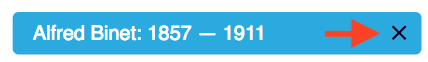
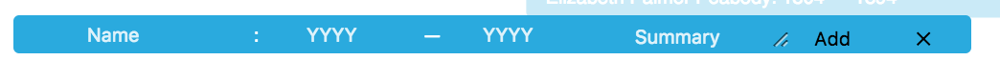

This project was bootstrapped with [Create React App](https://github.com/facebookincubator/create-react-app).

# AltSchool Timeline Challenge 1.0.2

## Getting Started

#### Prerequisites

- [node](https://nodejs.org/en/download/)

#### Installing

From project root (same directory as package.json) run:
```
npm install
```

#### Running

```
npm start
```

## Features
- Overlapping dates render on separate lanes.
- Makes efficient use of the lanes.
- Add events by clicking any blank area on the chart.
- Remove events by clicking "x" on the event.
- Record a virtually unlimited number of events.
- Add events as far back as 0 CE.
- Shows summary of person’s contributions on event mouseover.
- Data is persisted in localStorage.
- Deployed on [Heroku](https://altschool-timeline-si57r2gu.herokuapp.com/).

## Design Choices

#### SVG vs canvas vs divs
I determined that Canvas' [immediate-mode](https://msdn.microsoft.com/en-us/library/gg193983(v=vs.85).aspx) nature would make it be difficult to link components to their rendered shapes. Event listeners would also be a challenge, since they would have to be bound to the canvas element itself instead of actual shapes. Also, canvas is not accessible, so it would require a fallback anyways.

SVG and divs have similar performance characteristics to each other, but SVG is specialized for graphical representation so it facilitates simpler positioning and drawing different shapes. Given these facts (and that I've been wanting to experiment with SVG) I decided to use SVG for the graph.

However, SVG presented some unexpected difficulties for this app. For example, it is not possible to put text inside of the `<rect>` elements used to represent events on the chart.  I had to superimpose `<text>` elements on top of them, which means the rectangles are not aware of the size of their contents.

#### Styles
I used plain CSS instead of a preprocessor, so as not to require a more complex build process. This system would obviously be difficult to manage if the app were to continue growing. Styles are basically scoped to their components and not very reusable.

#### Event Add/Remove Functionality
I added the "remove event" button to the event itself, which seemed very intuitive:


To create a new event, ideally I wanted the user to be able to click on the timeline chart and drag to control the timespan of the new event. This would create the "add event" form which would look like a normal event but would accept values as user input. 

I was not able to implement most of this functionality within the time I allotted for this project, so the form will just appear when you click in an empty area of the chart:


#### TODO
- Assign uuids to each education theorist record. Using names as ids will cause issues if there are duplicate names.
- Bind tooltips for added events. 
- Fix event element overlap/overflow issues (truncate?).
- Responsiveness, scale chart to viewport.
- Improve error handling.
